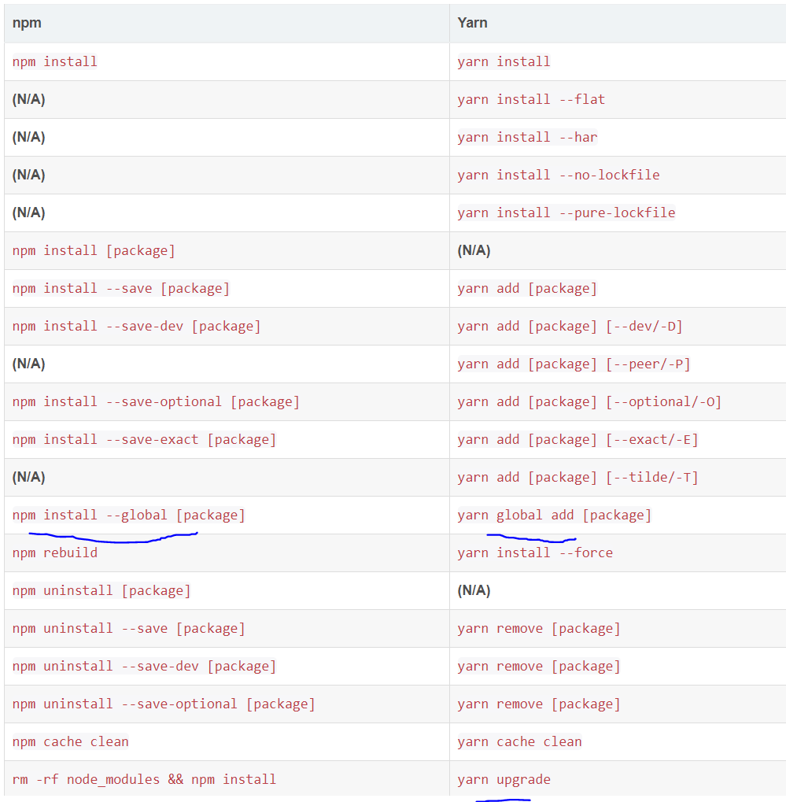

## 技术栈

- vue3.2+Ts+Vite
- [axios（ajax 请求）](https://www.kancloud.cn/yunye/axios/234845)
- [naive-ui(UI 组件库)](https://www.naiveui.com/zh-CN/dark/docs/introduction) 尤大推荐
- [vueuse(强大的函数库)](https://vueuse.org/) 尤大推荐

## 本项目采用 yarn



## 开发运行

```bash
    # 安装依赖
    yarn install

    # 本地开发 开启服务
    yarn dev

    # 打包
    yarn build


```

## 本项目 git Commit message 统一规范

使用[Angular 团队提交规范](https://github.com/angular/angular.js/blob/master/DEVELOPERS.md#-git-commit-guidelines)

常用的修改项

- feat: 增加新功能
- fix: 修复问题/BUG
- style: 代码风格相关无影响运行结果的
- perf: 优化/性能提升
- refactor: 重构
- revert: 撤销修改
- test: 测试相关
- docs: 文档/注释
- chore: 依赖更新/脚手架配置修改等
- workflow: 工作流改进
- ci: 持续集成
- types: 类型定义文件更改
- wip: 开发中

**[⬆ 返回顶部](#技术栈)**
